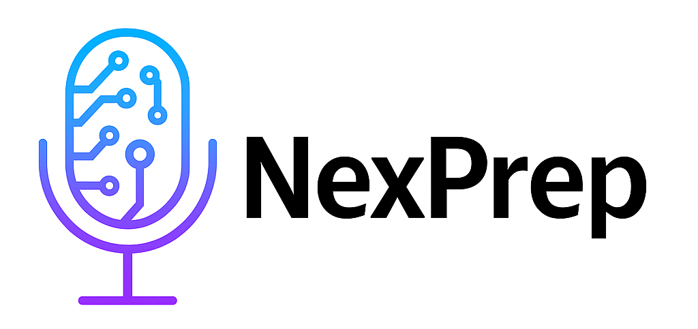

# NexPrep - AI-Powered Interview Preparation Platform



**NexPrep** is a cutting-edge SaaS platform that leverages artificial intelligence to provide personalized interview preparation experiences. Our platform helps job seekers practice, improve, and succeed in their interviews through AI-driven mock interviews, real-time feedback, and comprehensive performance analytics.

## 🚀 Features

### 🤖 AI-Powered Mock Interviews

- **Dynamic AI Interview Conversations**: The AI adapts the interview in real time based on the candidate's responses, job role, experience level, and selected interview type. It asks follow-up questions, probes deeper when needed, and adjusts the conversation naturally.
- **Real-time Voice Interaction**: Conduct live interviews using Vapi AI for natural conversation flow
- **Multiple Interview Types**: Technical, behavioral, experience-based, problem-solving, and leadership interviews

### 📊 Comprehensive Analytics & Feedback

- **Performance Ratings**: Detailed scoring across technical skills, communication, problem-solving, and experience
- **AI-Generated Insights**: Intelligent feedback with actionable recommendations
- **Progress Tracking**: Monitor improvement over time with detailed interview history

### 🎯 Customizable Interview Experience

- **Role-Specific Preparation**: Support for various positions from entry-level to expert
- **Difficulty Levels**: Easy, Medium, and Hard interview configurations
- **Multiple Formats**: Conversational, technical assessments, and mixed formats
- **Duration Flexibility**: Customizable interview lengths from 5 minutes to 1 hour

### 📚 Learning Resources Hub

- **NexPrep Vault**: Curated collection of high-quality interview preparation resources
- **Practice Materials**: Coding challenges, behavioral question frameworks, and industry-specific guides
- **Career Roadmaps**: Structured learning paths for different tech roles

### 🔐 Secure & Scalable

- **Authentication**: Email/password authentication with Supabase Auth and secure session management
- **Database**: Robust data storage with Supabase integration
- **Real-time Updates**: Live interview status and feedback delivery

## 🛠️ Technology Stack

### Frontend

- **Framework**: Next.js 14 (App Router)
- **Styling**: Tailwind CSS + Custom Components
- **UI Components**: Shadcn/ui component library
- **Icons**: Lucide React

### Backend & Database

- **Database**: Supabase (PostgreSQL)
- **Authentication**: Supabase Auth
- **Real-time**: Supabase Realtime subscriptions

### AI & Voice

- **AI Model**: OpenRouter LLM powering adaptive interview conversations and AI-generated feedback.
- **Voice AI**: Vapi AI for real-time voice interactions
- **Natural Language Processing**: Advanced conversation analysis

### Deployment & DevOps

- **Hosting**: Vercel Platform
- **Environment**: Environment-based configuration
- **Version Control**: Git with structured branching

## 📁 Project Structure

```
nexprep/
├── app/                          # Next.js App Router
│   ├── (main)/                   # Main application routes
│   │   ├── dashboard/            # User dashboard
│   │   │   ├── create-interview/ # Interview creation flow
│   │   │   └── practice/         # Practice resources
│   │   └── all-interviews/       # Interview history
│   ├── interview/                # Interview experience
│   │   └── [interview_id]/       # Dynamic interview routes
│   │       ├── start/            # Interview interface
│   │       ├── view/             # Interview details
│   │       └── feedback/         # Results & feedback
│   ├── api/                      # API endpoints
│   │   └── ai-feedback/          # AI feedback processing
│   ├── auth/                     # Authentication pages
│   └── globals.css               # Global styles
├── components/                   # Reusable UI components
│   └── ui/                       # Shadcn/ui components
├── context/                      # React Context providers
├── hooks/                        # Custom React hooks
├── lib/                          # Utility functions
├── public/                       # Static assets
└── services/                     # External service integrations
```

## 🚀 Getting Started

### Prerequisites

- Node.js 18+ (Download from [nodejs.org](https://nodejs.org/))
- npm or yarn package manager
- Git for version control

### Environment Setup

1. **Clone the repository**
   ```bash
   git clone <your-repo-url>
   cd nexprep
   ```

2. **Install dependencies**
   ```bash
   npm install
   # or
   yarn install
   ```

3. **Set up environment variables**
   ```bash
   # Copy the example environment file
   cp .env.example .env.local
   
   # Edit .env.local with your actual API keys and configuration
   ```

4. **Required API Keys & Services**
   
   **Supabase Setup:**
   - Create account at [supabase.com](https://supabase.com)
   - Create new project
   - Go to Settings > API to get your URL and anon key
   - Set up authentication and create required tables
   
   **OpenRouter API:**
   - Sign up at [openrouter.ai](https://openrouter.ai)
   - Generate API key for AI model access
   
   **Vapi AI:**
   - Create account at [vapi.ai](https://vapi.ai)
   - Get your public API key

5. **Database Setup**
   ```bash
   # Run database migrations (if you have them)
   # Set up your Supabase tables according to your schema
   ```

6. **Start the development server**
   ```bash
   npm run dev
   # or
   yarn dev
   ```

7. **Open your browser**
   Navigate to [http://localhost:3000](http://localhost:3000)

### Quick Start Guide

1. **Sign up/Login** - Create your account through the auth system
2. **Create Interview** - Go to Dashboard > Create Interview
3. **Configure Settings** - Set job role, experience level, and difficulty  
4. **Start Practice** - Begin your AI-powered mock interview
5. **Get Feedback** - Receive detailed performance analysis

### Troubleshooting

**Common Issues:**
- **Build errors**: Ensure all environment variables are set correctly
- **API failures**: Verify your API keys are valid and have sufficient credits
- **Audio issues**: Check browser permissions for microphone access
- **Database errors**: Confirm Supabase connection and table structure

**Getting Help:**
- Check the console for error messages
- Verify all environment variables in `.env.local`
- Ensure your Supabase project is properly configured
- npm, yarn, pnpm, or bun
- Supabase account
- Vapi AI account (for voice features)

### Installation

1. **Clone the repository**

   ```bash
   git clone https://github.com/Devarora13/NexPrep
   cd nexprep
   ```

2. **Install dependencies**

   ```bash
   npm install
   # or
   yarn install
   ```

3. **Environment Setup**
   Create a `.env.local` file in the root directory:

   ```env
   NEXT_PUBLIC_SUPABASE_URL=your_supabase_url
   NEXT_PUBLIC_SUPABASE_ANON_KEY=your_supabase_anon_key
   VAPI_API_KEY=your_vapi_api_key
   AI_MODEL_API_KEY=your_ai_model_key
   ```

4. **Database Setup**

   - Set up your Supabase project
   - Run the database migrations (SQL files in `/database` folder)
   - Configure authentication providers

5. **Run the development server**

   ```bash
   npm run dev
   ```

6. **Open your browser**
   Navigate to [h[ttps://nexprep-v2.vercel.app/](https://nex-prep-phi.vercel.app/)]

## 📖 Usage Guide

### Creating Your First Interview

1. **Sign Up/Login**: Create an account or sign in to your existing account
2. **Dashboard Access**: Navigate to your personalized dashboard
3. **Create Interview**: Click "Create New Interview" and fill out the form:
   - Job position and description
   - Experience level and required skills
   - Interview type and difficulty
   - Duration and format preferences
4. **Start the AI Interview**: Launch a live voice conversation with the AI interviewer.
5. **Dynamic Conversation**: The AI adapts questions based on your responses and asks contextual follow-ups.
6. **Receive Feedback**: View your overall score, strengths, weaknesses, improvement areas, and hiring recommendation.

### Managing Interview History

- **View All Interviews**: Access your complete interview history
- **Performance Analytics**: Track your progress over time
- **Detailed Feedback**: Review comprehensive feedback for each session
- **Export Reports**: Download detailed performance reports

### Accessing Practice Resources

- **NexPrep Vault**: Browse curated learning materials
- **Skill-based Resources**: Find materials specific to your target role
- **Progress Tracking**: Monitor your learning journey

## 🔧 Configuration

### Interview Types

- **Technical**: Code-related questions, architecture discussions
- **Behavioral**: STAR method, soft skills assessment
- **Experience-based**: Past roles and responsibilities
- **Problem Solving**: Analytical and creative thinking
- **Leadership**: Team management and strategic thinking

### Difficulty Levels

- **Easy**: Entry-level questions, basic concepts
- **Medium**: Intermediate challenges, moderate complexity
- **Hard**: Advanced scenarios, expert-level problems

### Experience Levels

- **Entry Level**: 0-2 years of experience
- **Mid Level**: 2-5 years of experience
- **Senior Level**: 5-8 years of experience
- **Expert Level**: 8+ years of experience

## 🤝 Contributing

We welcome contributions to NexPrep! Please follow these steps:

1. Fork the repository
2. Create a feature branch (`git checkout -b feature/AmazingFeature`)
3. Commit your changes (`git commit -m 'Add some AmazingFeature'`)
4. Push to the branch (`git push origin feature/AmazingFeature`)
5. Open a Pull Request

### Development Guidelines

- Follow the existing code style and conventions
- Write meaningful commit messages
- Add tests for new features
- Update documentation as needed

## 📝 API Documentation

### Feedback Generation

```javascript
POST /api/ai-feedback
{
  "conversation": "interview_transcript",
  "interview_id": "uuid"
}
```

## 🚀 Deployment

### Vercel Deployment (Recommended)

1. **Connect your repository** to Vercel
2. **Configure environment variables** in Vercel dashboard
3. **Deploy** - Vercel will automatically build and deploy your application

### Manual Deployment

1. **Build the application**

   ```bash
   npm run build
   ```

2. **Start the production server**
   ```bash
   npm start
   ```

## 📊 Performance & Analytics

- **Real-time Feedback**: Instant AI-powered performance analysis
- **Progress Tracking**: Historical performance data and trends
- **Skill Assessment**: Detailed breakdown of technical and soft skills
- **Recommendation Engine**: Personalized improvement suggestions

## 🔒 Security & Privacy

- **Data Encryption**: All user data is encrypted in transit and at rest
- **Secure Authentication**: Multi-factor authentication support
- **Privacy Compliant**: GDPR and privacy regulation compliant
- **Session Management**: Secure session handling and token management


## 📄 License

This project is licensed under the MIT License - see the [LICENSE](LICENSE) file for details.

## 🙏 Acknowledgments

- **Vapi AI** for voice interaction capabilities
- **Supabase** for backend infrastructure
- **Vercel** for seamless deployment
- **Shadcn/ui** for beautiful UI components
- **Open Source Community** for continuous inspiration

**Made with ❤️ by the Dev Arora**

_Empowering careers through intelligent interview preparation_
